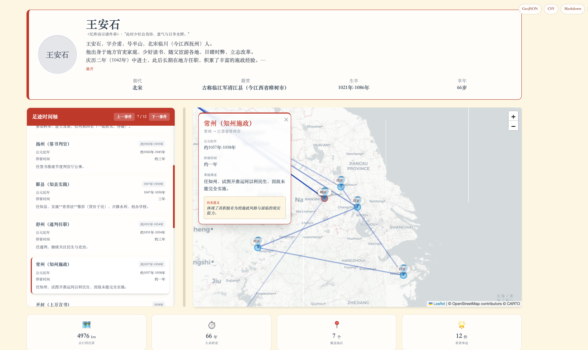
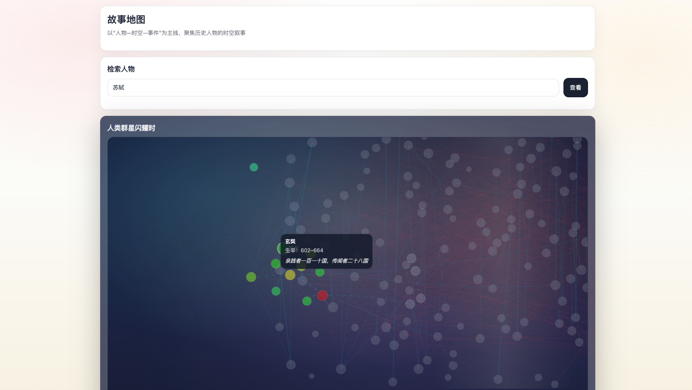
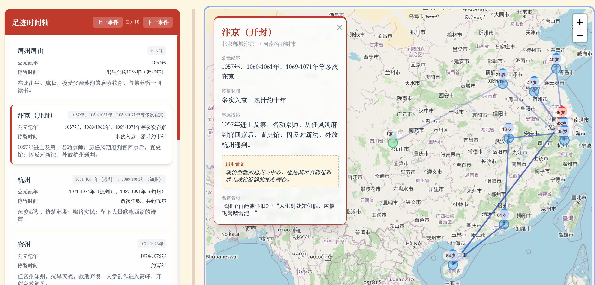
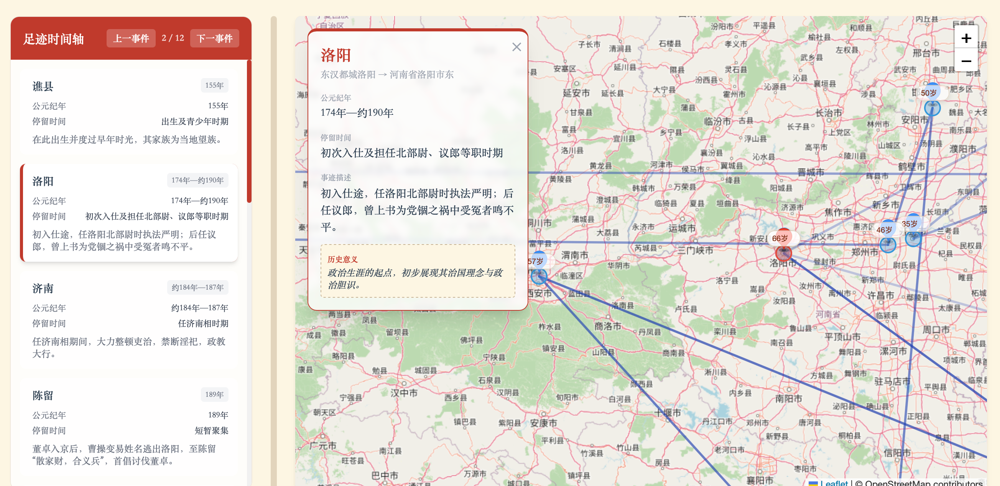

# 🗺️ StoryMap：从时空视角重新发现历史人物的生命轨迹 ✨

🧭 借助地图，我们可以把文学与历史研究中偏感性、经验性的“人物分析”，转成可回放、可检索的**时空轨迹**，关注人物的行走与迁徙，而不仅仅是片段化的个人经历。

🌍 从更宏观的视角重看历史人物：沿着他的足迹，我们能更容易洞悉成长变化，也能看到他与其他人物在时空上的关联。

“峨眉山月半轮秋，影入平羌江水流”，李白都去哪里追过月亮？

“问余平生事业，黄州惠州儋州”，苏轼的颠沛与旷达，是怎样的一条心酸路？

"出师未捷身先死，长使英雄泪满襟"，丞相的北伐之路是何等凶险？

**StoryMap** 面向中学学生/中学教师/文史爱好者，遵循 **“人物—时空—事件”** 的叙事主线，提供了地图可视化工具：输入一个名字，就生成一份可交互的足迹地图课件，让课本上的文字有了“地理的重量”。

### 🎯 为什么推荐给中学生/教师？
- **💡 辅助高效备课**：自动抓取人物生平，省去翻阅史料、查找古地名的繁琐过程。
- **📍 直观展现轨迹**：将文字叙述转化为地图足迹，人物的一生流转一目了然。
- **📚 跨学科教学**：契合“大语文”、“大历史”教学理念，在地图中讲诗词，在地理中读历史。
- **✨ 吸引学生注意力**：生成可交互网页，支持时间轴联动和事件弹窗，让课堂更有参与感。

### 📸 演示





主页当前默认展示：
- ECharts 关系图（支持拖拽节点、双击节点进入人物页）
- ECharts 世界地图（默认以中国为中心）

### ⚙️ 后台自动流程
项目在后台通过一套智能化的流程，为您打理好一切：

1. **输入姓名**：您只需输入想讲的人物（如：`曹操`）。
2. **生成故事**：自动整理人物档案、人生关键足迹（时间、地点、事件）以及教材中的考点。
3. **定位古地名**：系统会自动把“润州”、“京口”等古地名精准对应到现代地图坐标。
4. **生成课件网页**：最终打包成一个漂亮的 HTML 网页，包含时间轴和地图动效，直接用浏览器就能打开。

---

### 🚀 如何开始使用

#### ✅ 本地一键体验（推荐）
1) 启动生成服务（用于“输入人名 → 自动生成 HTML”）：
```bash
python3 storymap/script/story_map.py --serve --port 8765
```

2) 启动静态文件服务并打开主页：
```bash
python3 -m http.server 8000
```
浏览器打开：
- `http://localhost:8000/storymap/examples/story_map/`

#### ⏱️ 时间窗默认值
主页时间轴默认起止来自 `storymap/examples/story_map/stellar_home_data.json` 的 `default_start/default_end`。
可以通过脚本重建数据并指定默认时间窗，例如：
```bash
python3 tools/build_stellar_homepage.py --default-start 800 --default-end 1000
```

#### 🔎 未收录人物
如果主页搜索框输入的人物不在当前名单，会跳转到 `search.html` 给出相似候选与本地生成指引（静态页无法在浏览器内直接生成新人物页）。

#### 🧪 示例人物（可直接输入体验）
- 苏轼
- 李白
- 辛弃疾


### ✅ 无奖测试
猜猜这些名句是谁写的？
1. 峨眉山月半轮秋，影入平羌江水流


2. 问余平生事业，黄州惠州儋州


3. 关东有义士，兴兵讨群凶


---


TODO：
- 优化时间轴效果
